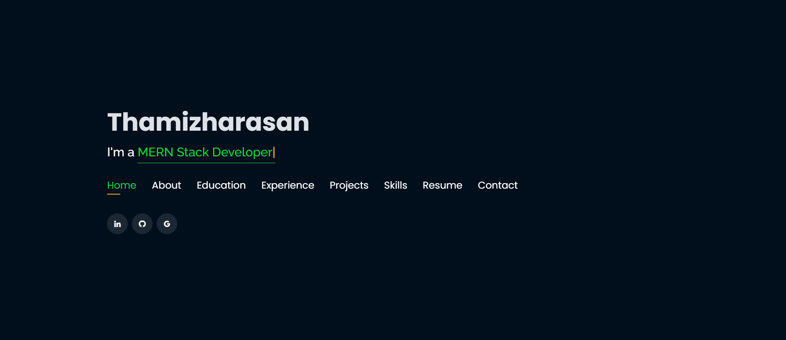

# Thamizharasan's Portfolio



## Overview

Welcome to my portfolio! This website showcases my skills, projects, and experiences. It was built using HTML, CSS, Bootstrap, and JavaScript, with vector logos to enhance the visual appeal.

## Website Link

Visit my portfolio: [thamizh.tech](https://thamizh.tech)

## Technologies Used

- HTML
- CSS
- Bootstrap
- JavaScript

## Features

- Responsive design for optimal viewing on various devices.
- Interactive elements powered by JavaScript.
- Modern and professional look with vector logos.

## How to Run Locally

1. Clone the repository:

   ```bash
   git clone https://github.com/thamizh5253/Portfolio.git
